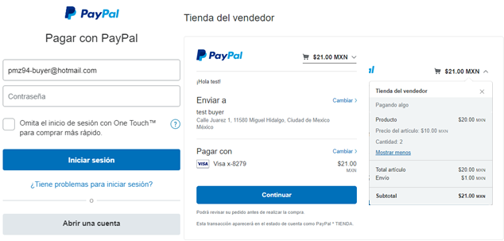

# PayPalPrueba

Usando uno de los APIs de PayPal para integrar su sistema de pagos.

-----------------------

### API REST usado

[PayPal SDK para PHP](https://paypal.github.io/PayPal-PHP-SDK/)

## Como funciona

```mermaid
graph TD
A((Inicio)) --> B(El usuario pide producto, ofrece precio y cuanto paga por c/u)
B --> C(PayPal crea el pago mas no el cargo aun)
C -- Redireccion --> D(PayPal pide datos de cuenta)
D --> E{El usuario elige}
E -- Iniciar sesion --> F(El usuario inicia sesion)
E -- Crear cuenta/Pagar como invitado --> G(Meter datos de tarjeta)
G --> H{Guardar datos y registrarse}
H -- Si --> F
F --> J
H -- No --> J(Verificar todo)
J --> K{Pagar}
K -- Si --> L(PayPal hace el cargo al usuario)
L --> M(El programa agrega el movimiento a la BD)
M --> N(pagorealizado.php?sucess=true)
N --> O(Se muestran los datos del movimiento)
K -- No --> P(pagorealizado.php?success=false)
O --> Q((Fin))
P --> Q
style A stroke:#000,stroke-width:4px
style Q stroke:#000,stroke-width:4px
```

## Instrucciones
Hasta ahora lo que se puede hacer con el programa es:
- Escribir un solo producto, precio unitario y cantidad.

- Redireccionarte al checkout de PayPal.
- Iniciar sesion con tu cuenta de PayPal.
    > Se supone que PayPal por defecto te deja pagar como invitado sin iniciar sesion, "aveces" en el checkout aparece el boton ese.
- Verificar el carrito que te muestra PayPal y pagar.

- Ya que se carga el pago se agrega a una base de datos
    > **Ojo:** la base de datos debe estar ya creada con todo y tabla.
- Mostrar la informacion

- Emitir un webhook para notificar cualquier movimiento (tarda un tiempo)
    > Hay que tener configurado el link hacia donde va el webhook